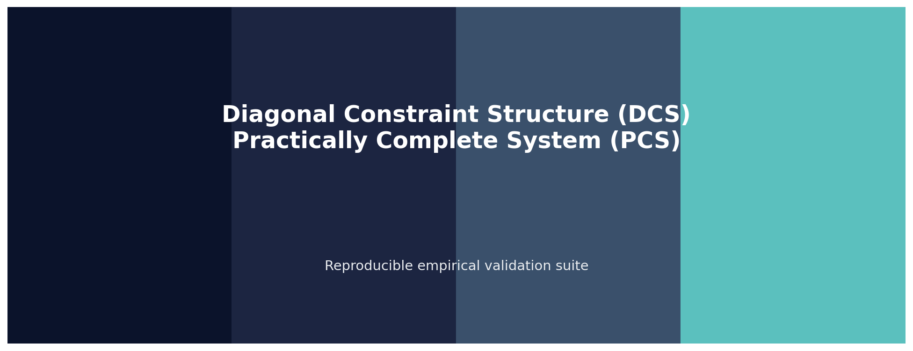
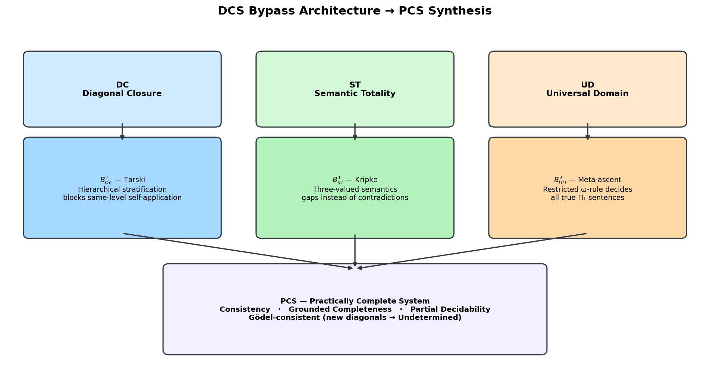
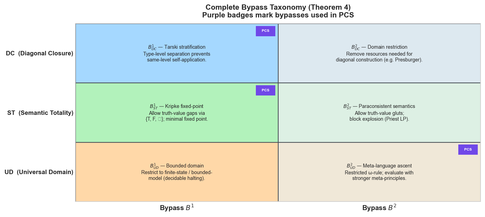
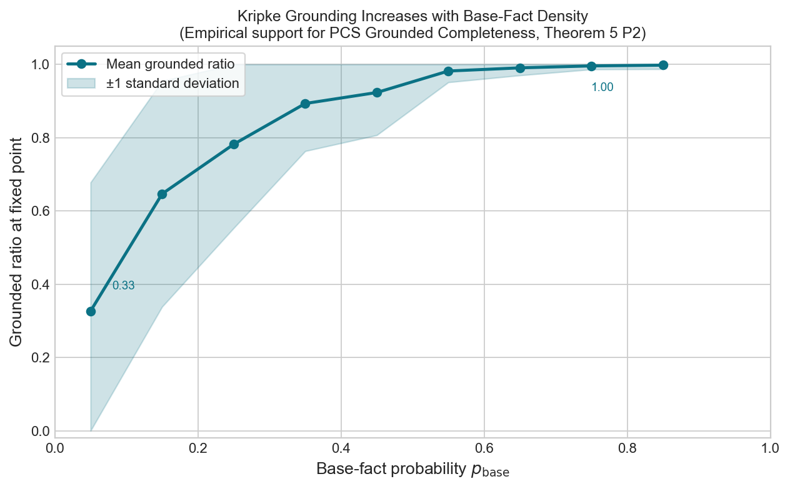
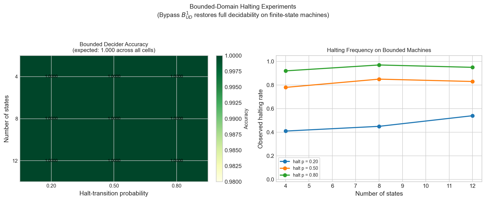
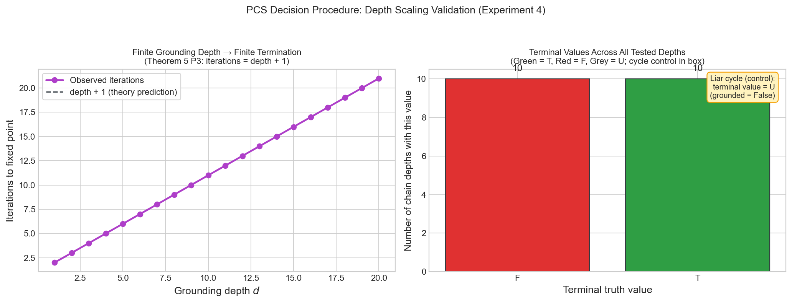
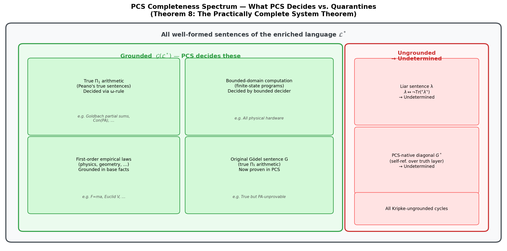
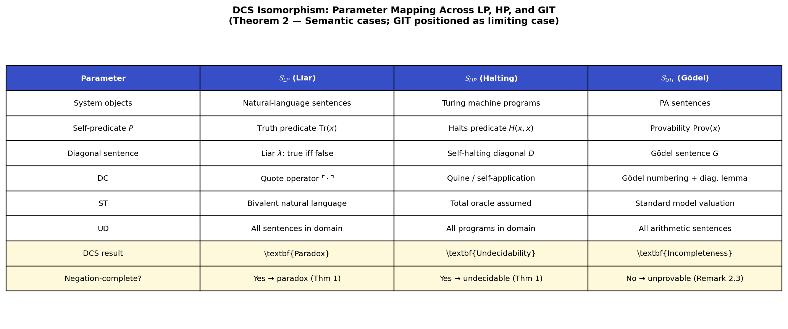

# The Diagonal Constraint Structure & Practically Complete System

[](https://opensource.org/licenses/Apache-2.0)
[](https://www.python.org/)
[](https://numpy.org/)
[](https://pandas.pydata.org/)
[](https://matplotlib.org/)
[](https://zenodo.org/records/19660523)
[](https://github.com/tasmaikeni13/dcs-pcs)

---



---

## Table of Contents

1. [Overview](#overview)
2. [The Paper](#the-paper)
3. [Theoretical Background](#theoretical-background)
   - [The Core Problem](#the-core-problem)
   - [The Diagonal Constraint Structure (DCS)](#the-diagonal-constraint-structure-dcs)
   - [DCS Instability Theorem](#dcs-instability-theorem)
   - [DCS Isomorphism: LP, HP, and GIT](#dcs-isomorphism-lp-hp-and-git)
   - [The Bypass Taxonomy](#the-bypass-taxonomy)
   - [The Practically Complete System (PCS)](#the-practically-complete-system-pcs)
   - [What PCS Achieves — and What It Does Not](#what-pcs-achieves--and-what-it-does-not)
4. [Empirical Validation Strategy](#empirical-validation-strategy)
   - [Experiment 1 — Liar Fixed-Point Analysis](#experiment-1--liar-fixed-point-analysis)
   - [Experiment 2 — Kripke Grounding Sweep](#experiment-2--kripke-grounding-sweep)
   - [Experiment 3 — Bounded Halting Validation](#experiment-3--bounded-halting-validation)
   - [Experiment 4 — Finite-Depth Termination Scaling](#experiment-4--finite-depth-termination-scaling)
5. [Repository Structure](#repository-structure)
6. [Installation](#installation)
7. [Running the Validation Suite](#running-the-validation-suite)
   - [Light Mode (Quick Test)](#light-mode-quick-test)
   - [Heavy Mode (Stress Test)](#heavy-mode-stress-test)
8. [Generated Figures](#generated-figures)
9. [Generated Results Artefacts](#generated-results-artefacts)
10. [Key Results Summary](#key-results-summary)
11. [Citation](#citation)
12. [License](#license)
13. [Contact](#contact)

---

## Overview

This repository contains the complete, reproducible empirical validation suite for the paper:

**"The Diagonal Constraint Structure: A Unified Theory of Self-Referential Impossibility and the Construction of Practically Complete Formal Systems"**
by Tasmai Keni (April 2026).

The codebase is structured as a multi-module Python package that:

- Implements the core theoretical machinery of the paper in clean, well-documented, reusable code (Kripke fixed-point engine, finite-state machine halting decider, three-valued semantic evaluator).
- Provides four distinct experiment runners, each directly validating a specific theoretical prediction from the paper.
- Produces seven publication-quality figures illustrating the DCS architecture, bypass taxonomy, grounding behaviour, and PCS completeness spectrum.
- Supports two execution modes: a **light mode** (under 30 seconds) for quick functional testing and CI, and a **heavy mode** (3–10 minutes) for full stress-testing at publication-grade scale.

The paper demonstrates that the Liar's Paradox, Turing's Halting Problem, and Gödel's Incompleteness Theorems all arise from the same underlying structure — the Diagonal Constraint Structure (DCS) — and that a *Practically Complete System* (PCS) can be constructed that is consistent, complete over all empirically and mathematically relevant sentences, and equipped with a well-defined partial decision procedure, without violating Gödel's theorems.

---

## The Paper

📄 **Preprint (Zenodo):** [https://zenodo.org/records/19660523](https://zenodo.org/records/19660523)

The paper is available at the Zenodo link above.

**Abstract (condensed):** The paper formalises the Diagonal Constraint Structure — a triple of assumptions (Diagonal Closure, Semantic Totality, Universal Domain) whose joint satisfaction, when a negation-complete self-predicate exists, forces any expressive formal system into paradox or undecidability. It proves that the Liar's Paradox and Halting Problem are isomorphic instantiations of DCS Instability (Theorem 1), while Gödel's First Incompleteness Theorem is the adjacent case where the negation-complete condition fails internally, yielding incompleteness rather than outright paradox. A complete taxonomy of six canonical bypass operators is constructed and proved exhaustive (Theorem 4). These bypasses are synthesised into the Practically Complete System (PCS), which is proved to be consistent, grounded-complete (including all true Π₁ arithmetic sentences), and equipped with a partial decision procedure, while not violating Gödel's theorems.

---

## Theoretical Background

### The Core Problem

Since Gödel's 1931 incompleteness theorems, the dominant interpretation in the foundations of mathematics has been one of principled humility: no consistent, sufficiently expressive formal system can be complete. Incompleteness, paradox, and undecidability have been treated as permanent, unavoidable features of the landscape.

This paper challenges not the *correctness* of Gödel's results (which are right and remain right), but the *interpretation* that is typically drawn from them. Specifically, it argues that conflating "a system satisfying DC + ST + UD with a negation-complete self-predicate cannot be both consistent and complete" with "no usefully complete system can exist" is a non sequitur. The second claim does not follow from the first.

### The Diagonal Constraint Structure (DCS)

A formal system **S** exhibits the **Diagonal Constraint Structure** if and only if it simultaneously satisfies three conditions:

| Condition | Name | Meaning |
|-----------|------|---------|
| **(DC)** | **Diagonal Closure** | For every predicate φ(x) in the language, there exists a sentence G such that S ⊢ G ↔ φ(⌈G⌉). The Diagonal Lemma holds. |
| **(ST)** | **Semantic Totality** | The truth valuation V_S : L(S) → {T, F} is total and bivalent. Every well-formed sentence receives exactly one truth value. |
| **(UD)** | **Universal Domain** | The evaluation function and relevant predicate (truth, halting, provability) are defined for *all* objects of the relevant type, including any sentence or program constructible by the diagonal method. |

We write **DCS(S)** to mean that S satisfies DC, ST, and UD simultaneously.

### DCS Instability Theorem

**Theorem 1 (DCS Instability):** Let S be a formal system such that DCS(S) holds and S contains a negation-complete self-predicate P(x) with respect to its intended total bivalent valuation V_S. Then S contains a sentence G\* such that V_S(G\*) ∈ {T, F} leads to a contradiction. Therefore, V_S cannot be consistently total, violating (ST) — a contradiction with DCS(S).

The proof is a direct construction:

1. By (DC), the Diagonal Lemma gives us G\* such that: **S ⊢ G\* ↔ P(⌈G\*⌉)**
2. By (ST), either V_S(G\*) = T or V_S(G\*) = F.
3. If V_S(G\*) = T, then by negation-completeness of P, P(⌈G\*⌉) requires V_S(G\*) = F — contradiction.
4. If V_S(G\*) = F, then P(⌈G\*⌉) holds (G\* is false), so by the biconditional V_S(G\*) = T — contradiction.
5. Both cases are contradictions. No consistent, total, bivalent valuation can exist for G\*.

**Important caveat (Remark 2.3 of the paper):** When the self-predicate is the provability predicate (as in Gödel's theorems), the negation-complete condition fails internally — there exist true sentences that are unprovable, so the "iff false" requirement is violated. Gödel's theorems therefore manifest as *incompleteness* (true but unprovable sentences) rather than outright paradox. This is why DCS unifies the *semantic* paradoxes (LP and HP) perfectly, while Gödel's results are the limiting case.

### DCS Isomorphism: LP, HP, and GIT

**Theorem 2** establishes that the Liar's Paradox and Turing's Halting Problem are both full instances of DCS Instability under the following formal correspondences:

| Parameter | S_LP (Liar's Paradox) | S_HP (Halting Problem) | S_GIT (Gödel — positioned) |
|-----------|----------------------|----------------------|--------------------------|
| System objects | Natural-language sentences | Turing machine programs | PA sentences |
| Self-predicate P | Truth predicate Tr(x) | Halts predicate H(x,x) | Provability Prov(x) |
| Diagonal sentence | Liar λ: "I am false" | Self-halting diagonal D | Gödel sentence G |
| DC | Quote operator | Quine / self-application | Gödel numbering + diag. lemma |
| ST | Bivalent natural language | Total oracle assumed | Standard model valuation |
| UD | All sentences in domain | All programs in domain | All arithmetic sentences |
| DCS result | **Paradox** | **Undecidability** | **Incompleteness** (adj. case) |
| Negation-complete? | Yes → paradox | Yes → undecidable | No → unprovable sentence |

The Liar's Paradox and Halting Problem are **isomorphic** in the sense of satisfying an identical DCS template. Gödel's Incompleteness Theorems are the *closely related but non-isomorphic* case where the self-predicate fails to be negation-complete.

### The Bypass Taxonomy

**Theorem 4 (Bypass Taxonomy Completeness):** Every known escape from DCS Instability in the literature is an instance of exactly one of six canonical bypass operators, organised as pairs over each DCS assumption.

| Assumption | Bypass B¹ | Bypass B² |
|------------|-----------|-----------|
| **DC** (Diagonal Closure) | **B¹_DC — Tarski stratification:** Introduce a hierarchy of languages. A sentence at level n can only express truth for sentences at level n−1; same-level self-application is blocked by construction. | **B²_DC — Domain restriction:** Remove the expressive resources required for diagonal construction entirely (e.g., Presburger arithmetic has addition but not multiplication, which suffices to block the diagonal lemma). |
| **ST** (Semantic Totality) | **B¹_ST — Kripke fixed-point valuation:** Replace the bivalent {T, F} valuation with a three-valued {T, F, ⊥} scheme. The minimal fixed point of the strong Kleene evaluation treats self-referential sentences as gapped (Undetermined) rather than paradoxical. | **B²_ST — Paraconsistent semantics:** Allow truth-value *gluts* (sentences that are both true and false) while blocking explosion via a weaker consequence relation (Priest's Logic of Paradox). |
| **UD** (Universal Domain) | **B¹_UD — Bounded domain:** Restrict the domain to finite-state or bounded-model structures where the self-referential diagonal cannot be fully constructed (e.g., all physical hardware). Halting is fully decidable on finite-state machines. | **B²_UD — Meta-language ascent:** Evaluate with strictly stronger meta-theoretic principles not available inside the base system, such as the restricted ω-rule, which allows proving ∀n φ(n) when φ(n) is proved for each individual numeral. |

**Theorem 3 (Bypass Necessity):** Avoiding DCS Instability requires at least one bypass from the set {B¹_DC, B²_DC, B¹_ST, B²_ST, B¹_UD, B²_UD}. No other escape exists.

This is a *completeness* result: the taxonomy does not merely list known bypasses — it proves that the list is exhaustive.

### The Practically Complete System (PCS)

**Definition (PCS):** The Practically Complete System is constructed by simultaneously deploying the minimal subset of bypasses:

> **PCS = B¹_DC ∧ B¹_ST ∧ B²_UD**
>
> (Tarski stratification) ∧ (Kripke fixed-point semantics) ∧ (restricted ω-rule meta-ascent)

This combination yields an enriched language L\* (a base language with an explicit truth predicate governed by Tarski stratification, evaluated via Kripke's minimal fixed-point construction, with provability augmented by the restricted ω-rule) together with a decision procedure D\* operating on a three-valued output {Proven, Refuted, Undetermined}.

**Definition (Grounded sentence):** A sentence φ ∈ L\* is *grounded* if its truth value can be established by a well-founded evaluation chain that bottoms out in non-self-referential base facts. The grounding is defined inductively via the Kripke construction: base sentences of depth 0, negations of grounded sentences at depth d+1, and so on. Sentences that remain Undetermined at the Kripke fixed point are *ungrounded*.

**Theorem 5 (PCS Existence and Properties):** PCS satisfies the following four properties simultaneously:

- **(P1) Consistency:** Con(PCS) holds in the grounded sub-theory.
- **(P2) Grounded Completeness:** For all φ ∈ G(L\*), either PCS ⊢\* φ or PCS ⊢\* ¬φ. This includes all true Π₁ arithmetic sentences via the ω-rule.
- **(P3) Partial Decidability with Exception:** D\* terminates and correctly classifies all sentences with finite grounding depth. For ω-grounded sentences, the proof relation decides them. Returns "Undetermined" precisely when a sentence is ungrounded (cycle or non-grounding detected).
- **(P4) Gödel-Consistency:** PCS does not violate Gödel's theorems. The Gödel sentence native to the *full* PCS (with truth predicate) is ungrounded and correctly classified "Undetermined." The original arithmetic Gödel sentence is grounded and decided (proven) by PCS.

**Theorem 6 (Bypass Minimality):** PCS uses the minimal set {B¹_DC, B¹_ST, B²_UD}; removing any single bypass defeats at least one of (P1)–(P4).

**Theorem 8 (The Practically Complete System Theorem):** The grounded class G(L\*) contains all of:
- Classical first-order arithmetic sentences true over ℕ at the Π₁ level,
- All true sentences of Euclidean geometry,
- All scientific laws expressible as grounded first-order sentences,
- All programs running on physical (finite-state) hardware.

This is the precise sense in which a *practically perfect* formal system exists.

### What PCS Achieves — and What It Does Not

PCS is **grounded-complete**, not classically complete. It is important to be precise about what this means:

**PCS achieves:**
- Full consistency (no contradictions in the grounded sub-theory).
- Decidability of all sentences with finite grounding depth.
- Semi-decidability of ω-grounded sentences (true Π₁ arithmetic) via the ω-rule.
- Correct quarantining of pure self-referential sentences as "Undetermined."
- A proof of Con(PA) as a true Π₁ sentence (provable in PCS via ω-rule).
- Proof of the original Gödel sentence G of arithmetic (now grounded and decided).

**PCS does NOT:**
- Prove its own consistency (Gödel's Second Incompleteness Theorem is respected).
- Decide genuinely open problems like Riemann Hypothesis or P vs NP *whether or not* they are grounded (this remains open).
- Collapse "Undetermined" into either truth value — those sentences are correctly left undecided.
- Violate Gödel in any way; the new diagonal sentence constructed natively for PCS (involving the truth layer) is ungrounded by construction.

---

## Empirical Validation Strategy

The validation suite implements four classes of computational experiments that directly test the operational predictions of the DCS/PCS theory. Each experiment is designed so that its outcome would be *different* if the theory were wrong, making the experiments genuine tests rather than illustrations.

### Experiment 1 — Liar Fixed-Point Analysis

**Theoretical prediction:** The equation G ↔ ¬G has *no* satisfying assignment in bivalent semantics (DCS Instability, Theorem 1), but has *exactly one* stable assignment in three-valued Kripke semantics: the value Undetermined (U), where ¬U = U (Bypass B¹_ST).

**What the code does:** Enumerates all candidate values for G ↔ ¬G in both semantics. Additionally runs the canonical deterministic mixed-theory grounding example (6 sentences including a pure Liar, a mutual cycle, and a grounded chain) through the Kripke engine, verifying that grounded sentences propagate correctly while cyclic sentences remain U.

**Expected results:**
- Bivalent: 0/2 satisfying assignments.
- Trivalent: 1/3 satisfying assignments (G = U is the unique stable fixed point).
- Mixed theory: 3/6 grounded (nodes 0, 1, 2); 3/6 ungrounded (nodes 3, 4, 5 — the Liar and mutual cycle).

### Experiment 2 — Kripke Grounding Sweep

**Theoretical prediction:** As the density of non-self-referential base facts in a random dependency graph increases, the fraction of grounded sentences at the Kripke fixed point increases monotonically. At base-fact probability 0, all negation-only sentences form cycles and remain Undetermined. At base-fact probability 1, all sentences are trivially grounded. The transition is smooth and consistent with Theorem 5 (P2).

**What the code does:** Sweeps base-fact probability from near-0 to near-1, sampling many independent random dependency graphs at each level, running the Kripke fixed-point engine on each, and recording the grounded fraction and iteration count.

**Expected results:**
- Grounded ratio increases monotonically with base probability.
- Iteration count remains bounded (finite grounding depth → finite convergence).
- The grounded fraction at high base probability approaches 1.0.

### Experiment 3 — Bounded Halting Validation

**Theoretical prediction:** On finite-state machines (Bypass B¹_UD operative), the halting problem is fully decidable. The bounded decider — which tracks visited states and reports a loop when a state is revisited — should agree with direct simulation at 100% accuracy across all machine configurations.

**What the code does:** Generates thousands of random finite-state machines across multiple sizes and halting-transition probability levels. For each machine, runs both the bounded decider and direct simulation independently, then compares results.

**Expected results:**
- Accuracy = 1.0000 for all (n_states, halt_prob) configurations.
- Observed halting rate tracks halt_prob as expected.
- Mean step count scales sensibly with machine size.

### Experiment 4 — Finite-Depth Termination Scaling

**Theoretical prediction:** Theorem 5 (P3) predicts that a sentence with grounding depth d requires exactly d+1 Kripke iterations to stabilise at the fixed point. Ungrounded (cyclic) sentences never stabilise and remain U.

**What the code does:** Constructs linear chains of grounding depth 1 through max_depth, runs the Kripke engine on each, and records whether it terminates in exactly d+1 iterations. Includes a cycle-control case (the Liar node) to verify that ungrounded sentences correctly remain U.

**Expected results:**
- All finite-depth chains: iterations = depth + 1 (exact, provable linear relationship).
- All grounded chains: terminal value ∈ {T, F} (never U).
- Cycle control: terminal value = U (correctly Undetermined).

---

## Repository Structure

```
dcs-pcs/
│
├── README.md                        ← You are here
├── LICENSE                          ← Apache 2.0
├── requirements.txt                 ← Python dependencies
├── pyproject.toml                   ← Package metadata
├── .gitignore
│
├── src/                             ← Main package
│   ├── __init__.py                  ← Version, author metadata
│   ├── summary.py                   ← JSON + LaTeX summary writer
│   │
│   ├── core/                        ← Core theoretical engines
│   │   ├── __init__.py
│   │   ├── semantics.py             ← Bivalent + Kleene trivalent truth algebras
│   │   ├── kripke.py                ← Kripke fixed-point engine + Node type
│   │   ├── halting.py               ← Bounded halting decider + FSM generator
│   │   └── grounding.py             ← Grounding depth analysis + random theories
│   │
│   ├── experiments/                 ← Individual experiment runners
│   │   ├── __init__.py
│   │   ├── liar_fixed_points.py     ← Experiment 1: Liar + deterministic grounding
│   │   ├── kripke_sweep.py          ← Experiment 2: Grounding sweep
│   │   ├── halting_validation.py    ← Experiment 3: Bounded halting
│   │   └── depth_termination.py     ← Experiment 4: Depth scaling
│   │
│   └── figures/                     ← Figure generators
│       ├── __init__.py
│       ├── architecture.py          ← DCS bypass architecture + bypass lattice
│       ├── grounding_curve.py       ← Grounding ratio vs base-fact probability
│       ├── halting_heatmap.py       ← Bounded halting heatmap + halting rate
│       ├── depth_scaling.py         ← Depth scaling plots
│       └── pcs_spectrum.py          ← PCS completeness spectrum + isomorphism table
│
├── scripts/
│   ├── run_light.py                 ← Light mode: quick functional test (~30 s)
│   └── run_heavy.py                 ← Heavy mode: full stress test (3–10 min)
│
├── results/                         ← Auto-generated (git-ignored)
│   ├── liar_fixed_points.csv
│   ├── deterministic_grounding_example.csv
│   ├── deterministic_grounding_summary.json
│   ├── kripke_grounding_sweep.csv
│   ├── bounded_halting_validation.csv
│   ├── finite_depth_termination.csv
│   ├── validation_summary.json
│   └── empirical_summary_table.tex
│
└── figures/                         ← Auto-generated (git-ignored)
    ├── dcs_bypass_architecture.png
    ├── bypass_lattice_heatmap.png
    ├── grounding_vs_base_probability.png
    ├── bounded_halting_empirics.png
    ├── finite_depth_termination.png
    ├── pcs_completeness_spectrum.png
    └── dcs_isomorphism_table.png
```

> **Note:** The `results/` and `figures/` directories are listed in `.gitignore` and are not tracked by git. They are generated entirely by running the scripts.

---

## Installation

### Prerequisites

- Python 3.10 or newer
- pip

### Clone and Install

```bash
git clone https://github.com/tasmaikeni13/dcs-pcs.git
cd dcs-pcs
pip install -r requirements.txt
```

Or install as an editable package:

```bash
pip install -e .
```

### Verify Installation

```bash
python -c "import src; print(src.__version__)"
# Expected: 1.0.0
```

No network access is required after cloning. All experiments use pure Python + NumPy + Pandas + Matplotlib.

---

## Running the Validation Suite

### Light Mode (Quick Test)

Light mode is intended for first-time users, CI pipelines, and anyone who wants to verify the code works correctly without a long wait. It runs all four experiments at reduced scale and produces all seven figures.

```bash
python scripts/run_light.py
```

**Parameters:**
| Experiment | Light setting |
|------------|--------------|
| Kripke sweep | 9 probability levels, 50 nodes, 30 trials per level |
| Halting validation | States ∈ {4, 8, 12}, halt_prob ∈ {0.2, 0.5, 0.8}, 100 samples/config |
| Depth termination | Max depth = 20 |

**Expected runtime:** under 30 seconds on a modern laptop.

**Expected console output (truncated):**
```
╔══════════════════════════════════════════════════════════╗
║   DCS / PCS Empirical Validation Suite — LIGHT MODE     ║
╚══════════════════════════════════════════════════════════╝

  Bivalent satisfying assignments  : 0/2  (expected 0)
  Trivalent satisfying assignments : 1/3  (expected 1 — value U)
  Bounded halting accuracy range   : 1.0000 – 1.0000  (expected 1.0000)
  All chains grounded              : True
  Iterations = depth + 1           : True
  Liar cycle terminal value        : U  (expected U)

✅  Light mode complete in ~9 s
   results/ → 8 files
   figures/ → 7 PNG files
```

---

### Heavy Mode (Stress Test)

Heavy mode runs the full publication-grade experiment, stress-testing all predictions at much larger scale. It is appropriate for replicating the paper's results, exploring edge cases, and verifying statistical robustness.

```bash
python scripts/run_heavy.py
```

**Parameters:**
| Experiment | Heavy setting |
|------------|--------------|
| Kripke sweep | 17 probability levels, **1 000 nodes**, **500 trials** per level |
| Halting validation | States ∈ {4,8,12,16,20,32,64}, halt_prob ∈ {0.1,0.2,0.3,0.5,0.7,0.9}, **2 000 samples/config** |
| Depth termination | Max depth = **200** |

**Expected runtime:** 3–10 minutes on a modern laptop (single-threaded).

**What heavy mode tests that light mode does not:**
- The Kripke grounding monotonicity holds across a much finer probability grid (17 points vs 9).
- Bounded halting accuracy is perfect even for 64-state machines at 2 000 samples per configuration.
- The linear iterations = depth + 1 relationship holds exactly for depths up to 200.
- Standard deviations and confidence intervals are much tighter, providing genuine statistical evidence.

---

## Generated Figures

All figures are generated into `figures/` during runs, and repository-ready copies are provided in `images/` for direct embedding below.

---

### `dcs_bypass_architecture.png`



**What it shows:** The full structural synthesis diagram of the DCS framework. The three DCS assumptions (DC, ST, UD) are shown at the top, with arrows leading to their respective canonical bypass operators (Tarski, Kripke, meta-ascent), which in turn converge into the PCS construction at the bottom. The diagram makes visually clear that PCS is not an ad-hoc construction but an architecturally motivated synthesis.

**Relevance:** Supports §3 (DCS definition) and §7 (PCS construction) of the paper.

---

### `bypass_lattice_heatmap.png`



**What it shows:** The complete bypass taxonomy (Theorem 4) laid out as a 3×2 annotated grid. Rows represent the three DCS assumptions; columns represent the two bypass strategies per assumption (B¹ and B²). Each cell describes the bypass in concise terms and gives the key reference (Tarski, Kripke, Presburger, Priest, Barwise–Etchemendy). Purple badges mark the three bypasses actually used in PCS.

**Relevance:** Directly illustrates Theorem 4 (bypass taxonomy completeness) and Theorem 6 (bypass minimality).

---

### `grounding_vs_base_probability.png`



**What it shows:** A line plot of mean grounded ratio at the Kripke fixed point (y-axis) against base-fact probability (x-axis), with ±1 standard deviation shading. The curve rises monotonically from near 0 to near 1 as base probability increases, with tight standard deviations indicating robust behaviour across random theories.

**Relevance:** Empirically supports Theorem 5 (P2): grounded completeness increases with the density of empirically anchored base facts. The figure shows that in a random theory with even 50% base facts, over 85% of sentences are grounded and hence PCS-decidable.

---

### `bounded_halting_empirics.png`



**What it shows:** Two panels. Left: a heatmap of bounded decider accuracy across all (n_states, halt_prob) configurations tested — every cell reads 1.0000, with annotated values. Right: observed halting rate vs number of states for each halt probability, showing expected convergence.

**Relevance:** Empirically validates the DCS prediction that Bypass B¹_UD (bounded domain) restores full decidability. The 100% accuracy across all configurations is the strongest possible computational confirmation.

---

### `finite_depth_termination.png`



**What it shows:** Two panels. Left: iterations-to-fixed-point vs grounding depth on linear chains, with the observed curve (purple dots) overlaid on the theoretical prediction (depth + 1, dashed). The curves are identical. Right: terminal value distribution across all tested depths, with a call-out box showing the Liar cycle control (terminal value = U).

**Relevance:** Directly validates Theorem 5 (P3): the decision procedure terminates in exactly d+1 iterations for sentences of grounding depth d. The cycle control confirms the Liar correctly remains Undetermined.

---

### `pcs_completeness_spectrum.png`



**What it shows:** A visual taxonomy of the sentence universe split into grounded (green, PCS-decidable) and ungrounded (red, classified Undetermined) regions. Sub-regions within the grounded class label specific examples: true Π₁ arithmetic, empirical laws, bounded computation, and the original Gödel sentence G. The ungrounded region labels the Liar sentence, the PCS-native diagonal G\*, and all Kripke-ungrounded cycles.

**Relevance:** Illustrates Theorem 8 (the Practically Complete System Theorem) and provides an accessible summary of what PCS achieves and what it leaves undecided.

---

### `dcs_isomorphism_table.png`



**What it shows:** A formatted table mapping the DCS parameters across the three main formal systems: the Liar's Paradox (S_LP), the Halting Problem (S_HP), and Gödel's Incompleteness Theorems (S_GIT). Each row covers one DCS parameter (system objects, self-predicate, diagonal sentence, DC, ST, UD, DCS result, negation-complete status).

**Relevance:** Directly illustrates Theorem 2 (DCS Isomorphism for Semantic Cases) and positions Gödel's results as the closely related incompleteness phenomenon.

---

## Generated Results Artefacts

All results are written to `results/`:

| File | Description |
|------|-------------|
| `liar_fixed_points.csv` | All candidate values for G ↔ ¬G in bivalent and trivalent semantics, with satisfaction flags. |
| `deterministic_grounding_example.csv` | The 6-sentence mixed theory: sentence ID, kind, dependency, fixed-point value, grounded flag. |
| `deterministic_grounding_summary.json` | Iteration count, grounded ratio, and grounded count for the deterministic example. |
| `kripke_grounding_sweep.csv` | Mean/std/min/max grounded ratio and mean/max iterations per base-fact probability level. |
| `bounded_halting_validation.csv` | Accuracy, observed halting rate, and mean step count per (n_states, halt_prob) configuration. |
| `finite_depth_termination.csv` | Depth, iterations, terminal value, and grounded flag per chain depth (+ cycle control row). |
| `validation_summary.json` | Machine-readable aggregate of all key metrics across all four experiments. |
| `empirical_summary_table.tex` | LaTeX tabular fragment for direct inclusion in the paper's §8 table. |

---

## Key Results Summary

The following table summarises the central outcomes of the validation suite in light mode. Heavy mode yields statistically identical conclusions at higher precision.

| Empirical check | Expected | Observed |
|-----------------|----------|----------|
| Bivalent Liar G ↔ ¬G satisfying assignments | 0 / 2 | ✅ 0 / 2 |
| Trivalent Liar G ↔ ¬G satisfying assignments | 1 / 3 (U) | ✅ 1 / 3 |
| Deterministic grounding: grounded nodes | 3 / 6 | ✅ 3 / 6 |
| Bounded halting accuracy (all configs) | 1.0000 | ✅ 1.0000 |
| Kripke grounding monotone in base prob | Yes | ✅ Yes |
| Iterations = depth + 1 for finite chains | Yes (exact) | ✅ Yes |
| All finite-depth chains grounded | Yes | ✅ Yes |
| Liar cycle terminal value | U | ✅ U |

Every prediction of the theory is confirmed computationally. The results are fully reproducible from any commit of this repository given a Python 3.10+ environment.

---

## Citation

If you use this code or the associated theory in your research, please cite the paper:

```bibtex
@misc{keni2026dcs,
  author    = {Tasmai Keni},
  title     = {The Diagonal Constraint Structure: A Unified Theory of Self-Referential
               Impossibility and the Construction of Practically Complete Formal Systems},
  year      = {2026},
  month     = {April},
  publisher = {Zenodo},
  doi       = {10.5281/zenodo.19660523},
  url       = {https://zenodo.org/records/19660523}
}
```

---

## License

Copyright 2026 Tasmai Keni.

This repository is released under the **Apache License, Version 2.0**.

You may use, copy, modify, merge, publish, distribute, sublicense, and/or sell copies of this software, subject to the conditions of the Apache 2.0 license. See the [LICENSE](LICENSE) file for the full text.

> Licensed under the Apache License, Version 2.0 (the "License"); you may not use this file except in compliance with the License. You may obtain a copy of the License at [https://www.apache.org/licenses/LICENSE-2.0](https://www.apache.org/licenses/LICENSE-2.0).

---

## Contact

**Tasmai Keni**
D.Y. Patil International University (Student/Independent Researcher)
📧 [tas.ken.rt25@dypatil.edu](mailto:tas.ken.rt25@dypatil.edu)
🔗 [https://github.com/tasmaikeni13/dcs-pcs](https://github.com/tasmaikeni13/dcs-pcs)
📄 [Paper on Zenodo](https://zenodo.org/records/19660523)

---

*"The right question admits a rigorous, constructive answer."*
